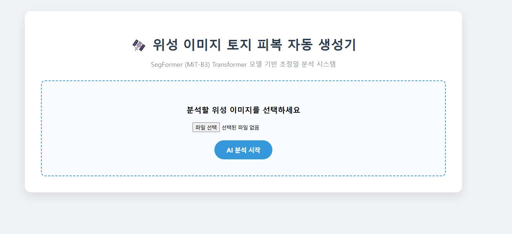
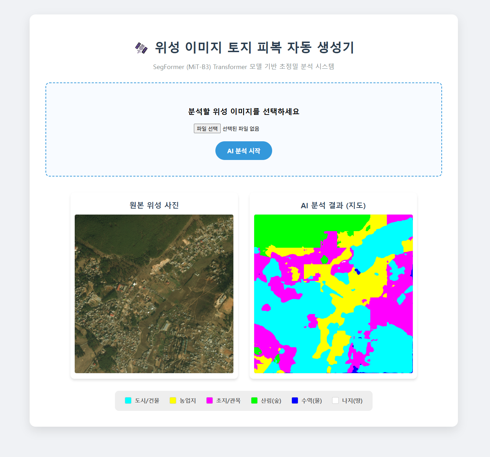
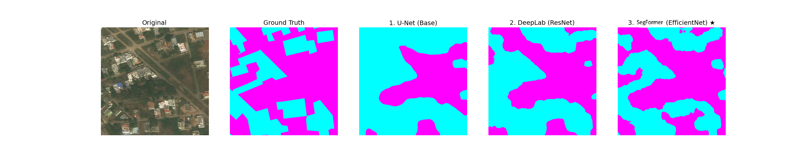

# 🛰️ 위성 이미지 기반 자동 토지 피복 지도 생성 시스템 (Satellite Image Land Cover Segmentation)

> **2025-2학기 파이썬기반딥러닝 기말 프로젝트**
> **팀원:** 20011202 김경민  
> **최종 성과:** mIoU 0.7853 달성 (SegFormer 모델 적용)


-brightgreen)


## 📌 프로젝트 개요 (Overview)
본 프로젝트는 **DeepGlobe Land Cover Classification Dataset**의 고해상도 위성 이미지를 픽셀 단위로 분류하는 **Semantic Segmentation** 시스템입니다.

초기 계획이었던 CNN 기반(U-Net, DeepLabV3+) 모델을 넘어, **Transformer 기반의 SegFormer** 모델을 도입하여 **Noisy Label(잘못된 정답 데이터)의 한계를 극복**했습니다. 최종적으로 사용자가 이미지를 업로드하면 실시간으로 분석하여 지도로 시각화해주는 **Flask 웹 애플리케이션**을 구축했습니다.

## 📸 최종 결과물 (Web Application)
**Overlap Sliding Window** 기법을 적용하여 대용량 이미지에서도 끊김 없는(Seamless) 분석이 가능합니다.

| 메인 화면 | 분석 결과 (SegFormer) |
|:---:|:---:|
|  |  |
> *사용자가 이미지를 업로드하면, AI가 도시, 농지, 산림, 수역 등으로 자동 분류하여 컬러 지도를 생성합니다.*

## 🏆 핵심 성과 및 모델 성능 (Performance)

### 1. 모델별 성능 비교 (Benchmark)
총 3단계의 고도화 과정을 통해 성능을 비약적으로 향상시켰습니다.

| 단계 | 모델 (Backbone) | mIoU Score | 비고 |
|:---:|:---|:---:|:---|
| **Final** | **SegFormer (MiT-B3)** | **0.7853 (1st) 👑** | **Transformer 기반. 정답지의 오류를 무시하고 실제 지형(길, 건물)을 찾아내는 압도적 성능** |
| Step 2 | DeepLabV3+ (EfficientNet-B4) | 0.7538 | CNN 기반 SOTA. 경계선 디테일 우수 |
| Step 1 | U-Net (ResNet-50) | 0.7257 | 베이스라인 모델 |

### 2. 정성적 평가 (Visual Comparison)
SegFormer 모델은 **Ground Truth(정답지)가 놓친 좁은 흙길이나 도로까지 정확하게 탐지**해내는 뛰어난 문맥 파악 능력을 보였습니다.


> *(좌측부터: 원본, 정답지, U-Net, DeepLab, SegFormer)* > *정답지(Ground Truth)에는 길이 표시되어 있지 않지만, SegFormer(맨 우측)는 중앙의 흰색 흙길을 정확히 찾아냈습니다.*

## 🛠️ 주요 기술 (Key Technologies)

* **Model Architecture:**
    * **Encoder:** Mix Transformer (MiT-B3) - 이미지의 전역적 문맥(Global Context) 파악
    * **Decoder:** MLP Decoder - 가볍고 빠른 분할 처리
* **Inference Strategy:**
    * **Overlap Sliding Window:** 2448x2448 대형 이미지를 512x512 패치로 나누어 추론할 때 발생하는 격자무늬(Grid Artifacts)를 제거하기 위해, 타일을 50%씩 겹쳐서 예측하고 확률을 평균(Probabilistic Averaging) 냈습니다.
* **Training Tech:**
    * **Label Smoothing:** 부정확한 정답 데이터(Noisy Label)에 대한 과적합 방지
    * **Albumentations:** 다양한 데이터 증강 기법 적용

## 💻 설치 및 실행 (Installation & Usage)

### 1. 환경 설정
```bash
# 리포지토리 복제
git clone [https://github.com/kyungmin7088-max/Pytorch-Land-Cover-UNet.git](https://github.com/kyungmin7088-max/Pytorch-Land-Cover-UNet.git)
cd Pytorch-Land-Cover-UNet

# 필수 라이브러리 설치
pip install -r requirements.txt
